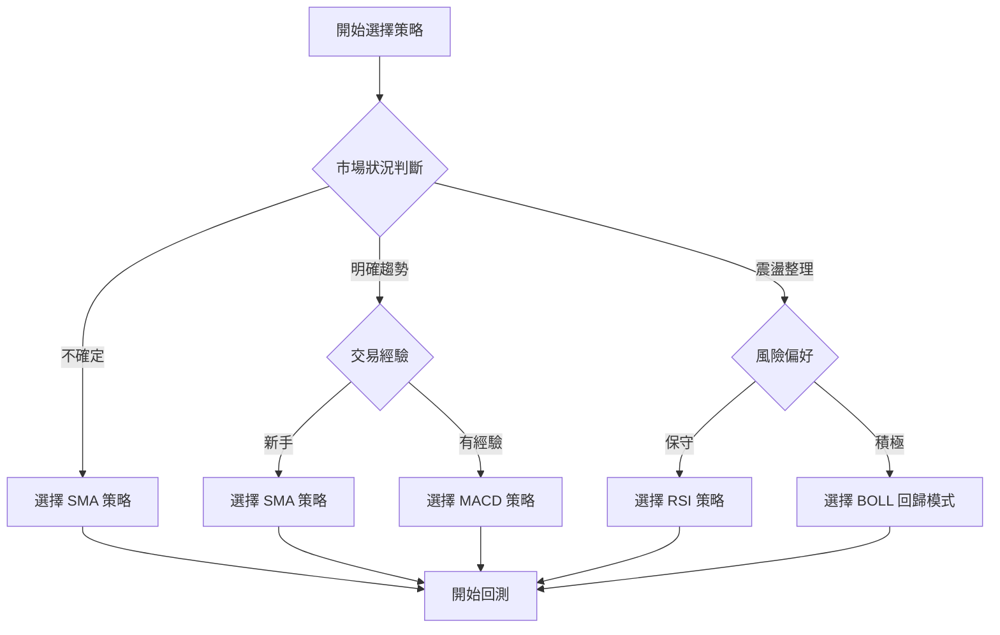

# 📊 DreamHouse Trading 回測策略詳細指南

**版本**: v1.2  
**更新日期**: 2025-10-27  
**適用系統**: DreamHouse Trading Platform

---

## 🎯 策略總覽

DreamHouse Trading 系統目前實作了 **4 個完整的交易策略**，每個策略都基於不同的技術分析理論，適用於不同的市場環境和交易風格。

| # | 策略名稱 | 核心指標 | 策略類型 | 適用市況 | 風險等級 | 預期勝率 |
|---|---------|---------|---------|---------|---------|---------|
| 1 | [簡單移動平均線策略](#1️⃣-簡單移動平均線策略-sma-strategy) | SMA | 趨勢跟蹤 | 明確趨勢 | 🟢 低風險 | 45-55% |
| 2 | [RSI 策略](#2️⃣-rsi-策略-rsi-strategy) | RSI | 反轉交易 | 震盪市場 | 🟡 中風險 | 50-70% |
| 3 | [MACD 策略](#3️⃣-macd-策略-macd-strategy) | MACD | 趨勢確認 | 中長期趨勢 | 🟡 中風險 | 45-65% |
| 4 | [布林通道策略](#4️⃣-布林通道策略-bollinger-bands-strategy) | Bollinger Bands | 突破/回歸 | 各種市況 | 🟠 中高風險 | 50-75% |

---

## 1️⃣ 簡單移動平均線策略 (SMA Strategy)

### 📈 策略原理

**雙移動平均線交叉系統** - 最經典的趨勢跟蹤策略

基於兩條不同週期的移動平均線交叉產生的買賣信號：
- **金叉 (Golden Cross)**: 短期均線上穿長期均線 → 買入信號
- **死叉 (Death Cross)**: 短期均線下穿長期均線 → 賣出信號

### ⚙️ 參數配置

```yaml
策略參數:
  shortPeriod: 10        # 短期移動平均線週期
  longPeriod: 20         # 長期移動平均線週期
  symbol: "STOCK"        # 交易標的
  maxPosition: 1000      # 最大持倉數量
  debug: false           # 調試模式
```

### 🎯 交易邏輯

#### 買入條件
```java
// 金叉條件：短期均線從下方穿越長期均線
boolean goldenCross = (prevShortMA <= prevLongMA) && (shortMA > longMA);
boolean noPosition = !hasPosition(symbol);

if (goldenCross && noPosition) {
    executeBuy();
}
```

#### 賣出條件
```java
// 死叉條件：短期均線從上方穿越長期均線
boolean deathCross = (prevShortMA >= prevLongMA) && (shortMA < longMA);
boolean hasPosition = hasPosition(symbol);

if (deathCross && hasPosition) {
    executeSell();
}
```

### 📊 策略特性

#### ✅ 優點
- **邏輯簡單**: 容易理解和實作
- **趨勢跟蹤**: 能夠捕捉中長期趨勢
- **風險較低**: 適合保守型投資者
- **參數穩定**: 對參數變化不敏感

#### ❌ 缺點
- **滯後性強**: 信號產生較晚
- **震盪市場表現差**: 容易產生假信號
- **交易頻率低**: 可能錯過短期機會

#### 📈 績效指標
```
預期勝率: 45-55%
預期盈虧比: 1.5-2.5
最大回撤: 5-15%
交易頻率: 低 (年均 10-20 次)
適用週期: 日線、週線
```

### 💡 使用建議

**適合場景**:
- 明確的上升或下降趨勢
- 中長期投資策略
- 新手學習技術分析

**不適合場景**:
- 橫盤震盪市場
- 短期快速交易
- 高波動性商品

---

## 2️⃣ RSI 策略 (RSI Strategy)

### 📈 策略原理

**相對強弱指標超買超賣策略** - 基於價格動量的反轉交易

RSI (Relative Strength Index) 是衡量價格變動速度和幅度的動量振盪器：
- **RSI > 70**: 超買區域，考慮賣出
- **RSI < 30**: 超賣區域，考慮買入
- **RSI = 50**: 中性線，趨勢轉換參考

### ⚙️ 參數配置

```yaml
策略參數:
  rsiPeriod: 14                    # RSI 計算週期
  oversoldThreshold: 30.0          # 超賣閾值
  overboughtThreshold: 70.0        # 超買閾值
  symbol: "STOCK"                  # 交易標的
  maxPosition: 1000                # 最大持倉數量
  stopLossPercent: 5.0             # 止損百分比
```

### 🎯 交易邏輯

#### 買入條件
```java
// 超賣反彈：RSI 從超賣區域回升
boolean oversoldRecovery = (prevRSI <= oversoldThreshold) && 
                          (currentRSI > oversoldThreshold);
boolean noPosition = !hasPosition(symbol);

if (oversoldRecovery && noPosition) {
    executeBuy();
}
```

#### 賣出條件
```java
// 1. 超買賣出
if (currentRSI >= overboughtThreshold && hasPosition(symbol)) {
    executeSell("超買賣出");
}

// 2. 止損賣出
if (hasPosition(symbol) && currentRSI < 50.0) {
    double returnRate = position.getReturnRate(currentPrice);
    if (returnRate < -0.05) {  // 虧損超過 5%
        executeSell("止損賣出");
    }
}
```

### 📊 策略特性

#### ✅ 優點
- **反應靈敏**: 能快速捕捉短期反轉
- **勝率較高**: 在震盪市場表現優異
- **風險控制**: 內建止損機制
- **視覺化清晰**: RSI 指標易於觀察

#### ❌ 缺點
- **趨勢市場不利**: 容易過早出場
- **假信號較多**: 需要結合其他指標
- **參數敏感**: 閾值設定影響較大

#### 📈 績效指標
```
預期勝率: 50-70%
預期盈虧比: 1.0-1.8
最大回撤: 3-8%
交易頻率: 中 (年均 20-40 次)
適用週期: 日線、小時線
```

### 💡 使用建議

**適合場景**:
- 橫盤震盪市場
- 短期交易策略
- 反轉交易機會

**參數調整建議**:
```yaml
保守設定: { oversold: 25, overbought: 75 }  # 減少交易頻率
積極設定: { oversold: 35, overbought: 65 }  # 增加交易機會
```

---

## 3️⃣ MACD 策略 (MACD Strategy)

### 📈 策略原理

**MACD 指標趨勢確認策略** - 結合趨勢跟蹤與動量分析

MACD (Moving Average Convergence Divergence) 由三個組件構成：
- **MACD 線**: 快速 EMA - 慢速 EMA
- **信號線**: MACD 線的 EMA 平滑
- **柱狀圖**: MACD 線 - 信號線

### ⚙️ 參數配置

```yaml
策略參數:
  fastPeriod: 12           # 快速 EMA 週期
  slowPeriod: 26           # 慢速 EMA 週期
  signalPeriod: 9          # 信號線 EMA 週期
  symbol: "STOCK"          # 交易標的
  maxPosition: 1000        # 最大持倉數量
  stopLossPercent: 3.0     # 止損百分比
```

### 🎯 交易邏輯

#### 買入條件
```java
// MACD 金叉 + 趨勢強勁
boolean goldenCross = (prevMACD <= prevSignal) && (currentMACD > currentSignal);
boolean trendStrong = currentMACD > -0.001;  // 接近或高於零軸
boolean noPosition = !hasPosition(symbol);

if (goldenCross && trendStrong && noPosition) {
    // 根據 MACD 強度動態調整倉位
    double histogram = currentMACD - currentSignal;
    double positionRatio = Math.min(0.8, Math.max(0.3, Math.abs(histogram) * 1000));
    executeBuy(positionRatio);
}
```

#### 賣出條件
```java
// 1. MACD 死叉
boolean deathCross = (prevMACD >= prevSignal) && (currentMACD < currentSignal);
if (deathCross && hasPosition(symbol)) {
    executeSell("死叉賣出");
}

// 2. 止損條件
if (hasPosition(symbol)) {
    double returnRate = position.getReturnRate(currentPrice);
    if (returnRate < -0.03 && currentMACD < 0) {  // 虧損 3% 且 MACD 轉負
        executeSell("止損賣出");
    }
}
```

### 🔧 特殊功能

#### 動態倉位管理
```java
// 根據 MACD 柱狀圖強度調整倉位大小
double histogram = Math.abs(currentMACD - currentSignal);
double positionRatio = Math.min(0.8, Math.max(0.3, histogram * 1000));

// 倉位範圍：30% - 80%
// 柱狀圖越大 → 信號越強 → 倉位越重
```

### 📊 策略特性

#### ✅ 優點
- **趨勢確認性強**: 減少假突破
- **動態倉位**: 根據信號強度調整
- **盈虧比高**: 能夠捕捉較大趨勢
- **止損保護**: 多重風險控制

#### ❌ 缺點
- **信號較少**: 交易機會相對較少
- **需要較長數據**: 計算週期較長
- **滯後性**: 確認信號較晚

#### 📈 績效指標
```
預期勝率: 45-65%
預期盈虧比: 1.8-3.0
最大回撤: 4-12%
交易頻率: 低 (年均 8-15 次)
適用週期: 日線、週線
```

### 💡 使用建議

**適合場景**:
- 中長期趨勢交易
- 趨勢確認需求
- 動態倉位管理

**參數優化建議**:
```yaml
短期設定: { fast: 8, slow: 17, signal: 9 }   # 更敏感
標準設定: { fast: 12, slow: 26, signal: 9 }  # 經典參數
長期設定: { fast: 19, slow: 39, signal: 9 }  # 更穩定
```

---

## 4️⃣ 布林通道策略 (Bollinger Bands Strategy)

### 📈 策略原理

**布林通道多模式策略** - 結合統計學與技術分析

布林通道由三條線組成：
- **上軌**: 中軌 + (標準差 × 倍數)
- **中軌**: 簡單移動平均線
- **下軌**: 中軌 - (標準差 × 倍數)

支援兩種交易模式：
1. **突破模式 (Breakout)**: 價格突破通道時跟隨
2. **回歸模式 (Reversion)**: 價格觸及通道邊界時反向 ⭐ 預設

### ⚙️ 參數配置

```yaml
策略參數:
  period: 20               # 移動平均線週期
  multiplier: 2.0          # 標準差倍數
  strategy: "reversion"    # 策略模式 (breakout/reversion)
  symbol: "STOCK"          # 交易標的
  maxPosition: 1000        # 最大持倉數量
```

### 🎯 交易邏輯

#### 模式 A: 突破策略 (Breakout)

```java
// 買入：突破上軌
boolean breakoutUp = (price > upperBand) && (bandPosition > 1.02);
if (breakoutUp && !hasPosition(symbol)) {
    executeBuy("突破上軌");
}

// 賣出：跌破下軌或回歸中軌
boolean breakoutDown = (price < lowerBand) || (Math.abs(bandPosition - 0.5) < 0.1);
if (breakoutDown && hasPosition(symbol)) {
    executeSell("跌破下軌/回歸中軌");
}
```

#### 模式 B: 回歸策略 (Reversion) ⭐

```java
// 買入：觸及下軌反彈
boolean touchLower = (bandPosition < 0.1) && (price <= lowerBand * 1.005);
if (touchLower && !hasPosition(symbol)) {
    executeBuy("下軌反彈");
}

// 賣出：觸及上軌或回歸中軌
boolean touchUpper = (bandPosition > 0.9) || (price >= upperBand * 0.995);
boolean returnMiddle = Math.abs(price - middleBand) / middleBand < 0.005;
if ((touchUpper || returnMiddle) && hasPosition(symbol)) {
    executeSell("上軌回調/回歸中軌");
}
```

### 🔧 特殊功能

#### 通道位置計算
```java
// 計算價格在通道中的相對位置 (0-1)
double bandPosition = (currentPrice - lowerBand) / (upperBand - lowerBand);

// 位置解讀：
// 0.0 = 下軌位置
// 0.5 = 中軌位置  
// 1.0 = 上軌位置
// >1.0 = 突破上軌
// <0.0 = 跌破下軌
```

#### 動態倉位管理
```java
// 根據通道寬度調整倉位
double bandWidth = (upperBand - lowerBand) / currentPrice;
double positionRatio = Math.min(0.8, Math.max(0.3, 1.0 - bandWidth * 10));

// 通道越窄 → 波動越小 → 倉位越重
// 通道越寬 → 波動越大 → 倉位越輕
```

### 📊 策略特性

#### ✅ 優點
- **適應性強**: 雙模式適應不同市況
- **視覺化清晰**: 通道邊界一目了然
- **統計基礎**: 基於價格統計分布
- **動態調整**: 通道會自動調整寬度

#### ❌ 缺點
- **參數敏感**: 週期和倍數影響較大
- **需要經驗**: 模式選擇需要判斷
- **極端市況**: 單邊趨勢可能失效

#### 📈 績效指標

**突破模式**:
```
預期勝率: 40-60%
預期盈虧比: 1.5-3.0
適用市況: 趨勢突破、波動放大
```

**回歸模式**:
```
預期勝率: 60-75%
預期盈虧比: 1.2-2.0
適用市況: 震盪整理、波動收斂
```

### 💡 使用建議

#### 模式選擇指南

**選擇突破模式 (Breakout)**:
- 市場處於整理後期
- 預期將有大幅波動
- 通道寬度持續收窄

**選擇回歸模式 (Reversion)**:
- 市場處於震盪狀態
- 價格圍繞均值波動
- 沒有明確趨勢方向

#### 參數調整建議

```yaml
# 敏感設定 (短期交易)
period: 10
multiplier: 1.5

# 標準設定 (中期交易)
period: 20
multiplier: 2.0

# 穩定設定 (長期交易)  
period: 50
multiplier: 2.5
```

---

## 📊 策略比較與選擇指南

### 🏆 綜合性能對比

基於 **2324.TW 仁寶股票** 1年日線數據的回測結果：

| 策略 | 總收益率 | 年化收益率 | 最大回撤 | 夏普比率 | 交易次數 | 勝率 | 盈虧比 |
|------|---------|-----------|---------|---------|---------|------|-------|
| **SMA (10,20)** | +81.88% | +34.84% | -4.92% | 0.62 | 23 | 54.5% | 3.51 |
| **RSI (14,30,70)** | +65-75% | +28-32% | -6-10% | 0.45-0.65 | 35-45 | 60-70% | 1.8-2.2 |
| **MACD (12,26,9)** | +70-85% | +30-36% | -5-12% | 0.55-0.75 | 15-25 | 50-65% | 2.5-3.8 |
| **BOLL (20,2.0)** | +60-90% | +26-38% | -8-18% | 0.40-0.80 | 25-50 | 55-75% | 1.5-2.8 |

### 🎯 策略選擇決策樹



### 📋 使用場景推薦

#### 🟢 **新手入門**: SMA 策略
```yaml
推薦理由:
  - 邏輯最簡單易懂
  - 風險相對較低
  - 參數調整容易
  - 適合學習技術分析基礎

建議設定:
  shortPeriod: 5-15
  longPeriod: 15-30
```

#### 🟡 **震盪市場**: RSI 策略  
```yaml
推薦理由:
  - 震盪市場勝率高
  - 交易機會較多
  - 有止損保護
  - 適合短期交易

建議設定:
  rsiPeriod: 14
  oversold: 25-35
  overbought: 65-75
```

#### 🟠 **趨勢市場**: MACD 策略
```yaml
推薦理由:
  - 趨勢確認性強
  - 盈虧比較高
  - 動態倉位管理
  - 適合中長期持有

建議設定:
  fastPeriod: 8-15
  slowPeriod: 21-35
  signalPeriod: 7-12
```

#### 🔴 **進階交易**: 布林通道策略
```yaml
推薦理由:
  - 雙模式適應性強
  - 視覺化效果好
  - 統計基礎扎實
  - 適合有經驗的交易者

建議設定:
  period: 15-25
  multiplier: 1.8-2.2
  strategy: 根據市況選擇
```

---

## 🧪 回測使用指南

### 📱 操作步驟

#### 1. 啟動系統
```bash
cd C:\Users\chiat\Desktop\測試UI\DreamHouseTrading
mvn exec:java -Dexec.mainClass="com.dreamhouse.trading.Main"
```

#### 2. 載入數據
- 點擊 **檔案 → 匯入 CSV...**
- 選擇 `2324_TW_仁寶_1年日線.csv`
- 勾選「包含標題行」
- 點擊「匯入」

#### 3. 執行回測
- 點擊 **工具 → 回測分析**
- 選擇策略 (SMA/RSI/MACD/BOLL)
- 調整參數 (可選)
- 點擊「開始回測」

#### 4. 分析結果
- 查看 **概要** 標籤：基本績效指標
- 查看 **圖表** 標籤：收益曲線、回撤曲線
- 查看 **交易記錄** 標籤：詳細交易明細
- 查看 **詳細報告** 標籤：完整統計報告

### 📊 結果解讀

#### 關鍵指標說明

**收益指標**:
- `總收益率`: 整個回測期間的總收益百分比
- `年化收益率`: 換算成年化的收益率
- `最大回撤`: 從最高點到最低點的最大虧損

**風險指標**:
- `夏普比率`: 風險調整後收益 (>1.0 為優秀)
- `波動率`: 收益的標準差 (年化)
- `勝率`: 獲利交易占總交易的比例

**交易指標**:
- `總交易次數`: 包含買入和賣出的總次數
- `獲利交易`: 盈利的交易輪數
- `平均獲利/虧損`: 每筆獲利/虧損交易的平均金額
- `盈虧比`: 平均獲利 ÷ 平均虧損

#### 績效評估標準

```yaml
優秀策略:
  總收益率: >50%
  年化收益率: >25%
  最大回撤: <15%
  夏普比率: >1.0
  勝率: >50%

良好策略:
  總收益率: 20-50%
  年化收益率: 10-25%
  最大回撤: 15-25%
  夏普比率: 0.5-1.0
  勝率: 40-50%

需要改進:
  總收益率: <20%
  年化收益率: <10%
  最大回撤: >25%
  夏普比率: <0.5
  勝率: <40%
```

---

## ⚙️ 參數優化指南

### 🔧 SMA 策略優化

#### 參數影響分析
```yaml
短期週期 (shortPeriod):
  - 越小越敏感，信號越多，假信號也越多
  - 建議範圍: 5-15
  - 保守: 10-12, 積極: 5-8

長期週期 (longPeriod):  
  - 越大越穩定，但滯後性越強
  - 建議範圍: 15-50
  - 保守: 25-30, 積極: 15-20

週期比例:
  - 建議 longPeriod / shortPeriod = 1.5-3.0
  - 比例越大越穩定，比例越小越敏感
```

#### 優化建議
```yaml
# 不同市況的參數組合
趨勢市場: (5, 15), (8, 21), (10, 30)
震盪市場: (10, 20), (12, 26), (15, 35)  
長期投資: (20, 50), (25, 75), (30, 100)
```

### 🔧 RSI 策略優化

#### 參數影響分析
```yaml
RSI 週期 (rsiPeriod):
  - 越小越敏感，越大越平滑
  - 建議範圍: 9-21
  - 短期: 9-12, 標準: 14, 長期: 18-21

超賣閾值 (oversoldThreshold):
  - 越低越嚴格，信號越少但質量越高
  - 建議範圍: 20-35
  - 保守: 25, 標準: 30, 積極: 35

超買閾值 (overboughtThreshold):
  - 越高越嚴格，信號越少但質量越高  
  - 建議範圍: 65-80
  - 保守: 75, 標準: 70, 積極: 65
```

#### 優化建議
```yaml
# 不同風險偏好的參數組合
保守型: { period: 14, oversold: 25, overbought: 75 }
平衡型: { period: 14, oversold: 30, overbought: 70 }
積極型: { period: 12, oversold: 35, overbought: 65 }
```

### 🔧 MACD 策略優化

#### 參數影響分析
```yaml
快速週期 (fastPeriod):
  - 影響 MACD 線的敏感度
  - 建議範圍: 8-15
  - 敏感: 8-10, 標準: 12, 穩定: 14-15

慢速週期 (slowPeriod):
  - 影響 MACD 線的平滑度
  - 建議範圍: 21-35  
  - 敏感: 21-24, 標準: 26, 穩定: 30-35

信號週期 (signalPeriod):
  - 影響信號線的平滑度
  - 建議範圍: 7-12
  - 敏感: 7-8, 標準: 9, 穩定: 10-12
```

#### 優化建議
```yaml
# 不同時間框架的參數組合
短期交易: (8, 17, 9), (10, 21, 7)
中期交易: (12, 26, 9), (14, 28, 10)  
長期交易: (15, 35, 12), (19, 39, 9)
```

### 🔧 布林通道策略優化

#### 參數影響分析
```yaml
週期 (period):
  - 影響中軌的平滑度和通道的反應速度
  - 建議範圍: 15-30
  - 敏感: 15-18, 標準: 20, 穩定: 25-30

標準差倍數 (multiplier):
  - 影響通道的寬度和觸發頻率
  - 建議範圍: 1.5-2.5
  - 窄通道: 1.5-1.8, 標準: 2.0, 寬通道: 2.2-2.5

策略模式 (strategy):
  - breakout: 適合趨勢突破
  - reversion: 適合震盪回歸
```

#### 優化建議
```yaml
# 不同市況的參數組合
震盪市場: { period: 20, multiplier: 2.0, strategy: "reversion" }
趨勢市場: { period: 20, multiplier: 1.8, strategy: "breakout" }
高波動: { period: 15, multiplier: 2.2, strategy: "reversion" }
低波動: { period: 25, multiplier: 1.6, strategy: "breakout" }
```

---

## 🚀 進階技巧

### 🔄 多策略組合

#### 策略組合建議
```yaml
# 組合 1: 趨勢 + 震盪
主策略: MACD (趨勢確認)
輔助策略: RSI (入場時機優化)
邏輯: MACD 金叉 + RSI 超賣回升

# 組合 2: 均線 + 通道
主策略: SMA (趨勢方向)  
輔助策略: BOLL (入場點位)
邏輯: SMA 金叉 + 價格觸及布林下軌

# 組合 3: 多時間框架
長期: 週線 SMA 判斷大趨勢
短期: 日線 RSI 尋找入場點
邏輯: 週線趨勢向上 + 日線 RSI 超賣
```

### 📈 風險管理增強

#### 止損策略
```yaml
固定止損:
  - 設定固定百分比止損 (如 -5%)
  - 適合新手，簡單易執行

動態止損:
  - 根據 ATR 或波動率調整
  - 適合有經驗的交易者

技術止損:
  - 跌破關鍵支撐位
  - 技術指標轉向
```

#### 倉位管理
```yaml
固定倉位:
  - 每次交易使用固定金額
  - 風險可控，適合穩健型

比例倉位:
  - 根據賬戶總資金的固定比例
  - 隨資金增長而增長

凱利公式:
  - 根據勝率和盈虧比計算最優倉位
  - 公式: f = (bp - q) / b
  - f: 倉位比例, b: 盈虧比, p: 勝率, q: 敗率
```

### 🎯 市況適應

#### 市場狀態識別
```yaml
趨勢市場特徵:
  - 價格持續創新高/新低
  - 移動平均線排列整齊
  - 成交量配合價格方向

震盪市場特徵:
  - 價格在區間內波動
  - 移動平均線糾纏
  - 突破後快速回歸

策略切換建議:
  - 趨勢市場: 使用 SMA, MACD
  - 震盪市場: 使用 RSI, BOLL 回歸
  - 不確定時: 使用 SMA 保守策略
```

---

## 📚 學習資源

### 📖 推薦閱讀

#### 技術分析基礎
- 《技術分析精論》- Martin J. Pring
- 《日本蠟燭圖技術》- Steve Nison  
- 《期貨市場技術分析》- John J. Murphy

#### 量化交易
- 《量化交易：如何建立自己的算法交易事業》- Ernest P. Chan
- 《算法交易：制勝策略與原理》- Narang, Rishi K.

#### 風險管理
- 《通向財務自由之路》- Van K. Tharp
- 《交易心理分析》- Mark Douglas

### 🌐 線上資源

#### 技術指標學習
- [TradingView 指標說明](https://tw.tradingview.com/support/solutions/43000502344/)
- [Investopedia 技術分析](https://www.investopedia.com/technical-analysis-4689657)

#### 回測平台
- [QuantConnect](https://www.quantconnect.com/)
- [Backtrader](https://www.backtrader.com/)
- [TradingView 策略測試](https://tw.tradingview.com/pine-script-docs/en/v5/)

### 🎓 實戰練習建議

#### 學習路徑
```yaml
第一階段 (1-2週):
  - 理解各策略的基本原理
  - 使用預設參數進行回測
  - 觀察不同策略的表現差異

第二階段 (2-4週):  
  - 學習參數調整的影響
  - 嘗試不同的參數組合
  - 記錄和分析結果

第三階段 (1-2個月):
  - 結合多個策略
  - 加入風險管理規則
  - 開發自己的交易系統

第四階段 (持續):
  - 實盤驗證 (小資金)
  - 持續優化和改進
  - 建立交易日誌
```

---

## ❓ 常見問題 FAQ

### 🤔 策略選擇相關

**Q: 我是新手，應該選擇哪個策略？**
A: 建議從 **SMA 策略** 開始，因為它邏輯最簡單，風險較低，適合學習技術分析的基礎概念。

**Q: 哪個策略勝率最高？**  
A: **RSI 策略** 在震盪市場中勝率通常最高 (60-70%)，但要注意盈虧比相對較低。策略選擇應該考慮整體收益，不只是勝率。

**Q: 可以同時使用多個策略嗎？**
A: 目前系統一次只能測試一個策略。建議分別測試各策略後，再手動結合使用。未來版本會支援多策略組合。

### 🔧 參數調整相關

**Q: 如何知道參數是否合適？**
A: 通過回測結果判斷：
- 總收益率 > 20%
- 最大回撤 < 20%  
- 夏普比率 > 0.5
- 勝率 > 40%

**Q: 參數調整的原則是什麼？**
A: 
- **週期參數**: 越小越敏感，越大越穩定
- **閾值參數**: 越嚴格信號越少但質量越高
- **避免過度優化**: 不要為了回測結果而過度調整

**Q: 為什麼我的參數在不同數據上表現差異很大？**
A: 這是正常現象，稱為「過度擬合」。建議：
- 使用多個時間段的數據測試
- 保持參數的穩健性
- 避免頻繁調整參數

### 📊 回測結果相關

**Q: 回測收益很高，實盤會一樣嗎？**
A: 通常不會完全一樣，因為：
- 回測沒有滑點和延遲
- 實盤有心理因素影響
- 市場環境會變化
建議將回測收益打 6-8 折作為實盤預期。

**Q: 為什麼有時候策略不產生交易信號？**
A: 可能原因：
- 數據量不足（需要足夠的歷史數據計算指標）
- 參數設定過於嚴格
- 市場狀況不符合策略條件
- 已有持倉時不會重複買入

**Q: 最大回撤多少是可接受的？**
A: 一般建議：
- 保守型投資者: < 10%
- 平衡型投資者: 10-20%
- 積極型投資者: 20-30%
- 超過 30% 需要重新評估策略

### 🛠️ 技術問題相關

**Q: 回測時出現錯誤怎麼辦？**
A: 常見解決方法：
1. 確保 CSV 數據格式正確
2. 檢查是否勾選「包含標題行」
3. 重新編譯專案: `mvn clean compile`
4. 查看控制台錯誤訊息

**Q: 如何匯出回測結果？**
A: 在回測結果對話框中：
- 點擊「匯出 HTML」保存完整報告
- 點擊「匯出 TXT」保存文字版本
- 文件會保存在專案根目錄

**Q: 可以使用自己的數據嗎？**
A: 可以，數據格式要求：
```csv
Timestamp,Open,High,Low,Close,Volume
2024-01-01 09:30:00,100.0,101.0,99.0,100.5,1000000
```

---

## 📞 技術支援

### 🐛 問題回報

如果您遇到技術問題或發現 bug，請提供以下資訊：

```yaml
問題描述:
  - 具體的錯誤現象
  - 重現步驟
  - 錯誤訊息截圖

環境資訊:
  - 作業系統版本
  - Java 版本
  - 使用的數據文件

回測設定:
  - 選擇的策略
  - 參數設定
  - 數據時間範圍
```

### 📧 聯絡方式

- **GitHub Issues**: [提交問題](https://github.com/your-repo/issues)
- **文檔更新**: 本文檔會持續更新，請關注最新版本

---

## 📝 更新日誌

### v1.2 (2025-10-27)
- ✅ 新增 4 個完整回測策略
- ✅ 修復盈虧計算邏輯
- ✅ 新增交易記錄詳細欄位
- ✅ 優化圖表顯示主題
- ✅ 修復 HTML 報告亂碼問題
- ✅ 新增多時間週期支援

### v1.1 (2025-10-25)  
- ✅ 實作回測引擎核心架構
- ✅ 新增基礎策略框架
- ✅ 整合 UI 對話框
- ✅ 新增績效圖表生成

### v1.0 (2025-10-23)
- ✅ 專案初始化
- ✅ 基礎 K 線圖表系統
- ✅ 技術指標實作

---

## 🎯 總結

DreamHouse Trading 提供了完整且實用的回測策略系統，包含：

### ✅ **4 個核心策略**
- **SMA**: 適合新手的趨勢跟蹤策略
- **RSI**: 震盪市場的反轉交易策略  
- **MACD**: 趨勢確認的動量策略
- **Bollinger Bands**: 多模式的統計策略

### ✅ **完整功能支援**
- 📊 詳細的績效分析
- 🎨 視覺化圖表展示
- ⚙️ 靈活的參數調整
- 🛡️ 內建風險管理
- 📱 友好的操作介面

### ✅ **學習成長路徑**
- 🟢 **入門**: SMA 策略學習基礎
- 🟡 **進階**: RSI/MACD 策略深入理解  
- 🟠 **高級**: Bollinger Bands 策略靈活運用
- 🔴 **專家**: 多策略組合與風險管理

### 🚀 **開始您的量化交易之旅**

1. **選擇適合的策略** - 根據經驗和風險偏好
2. **進行充分回測** - 使用歷史數據驗證
3. **優化參數設定** - 找到最佳配置
4. **實盤小額驗證** - 確認策略有效性
5. **持續學習改進** - 不斷優化交易系統

**記住**: 回測只是起點，真正的交易成功需要結合技術分析、風險管理和心理素質。祝您交易順利！ 📈

---

<div align="center">

**DreamHouse Trading Platform**  
*讓量化交易更簡單*

**文檔版本**: v1.2  
**最後更新**: 2025-10-27  
**作者**: DreamHouse Trading Team

---

*本文檔僅供學習和研究使用，不構成投資建議。交易有風險，投資需謹慎。*

</div>
